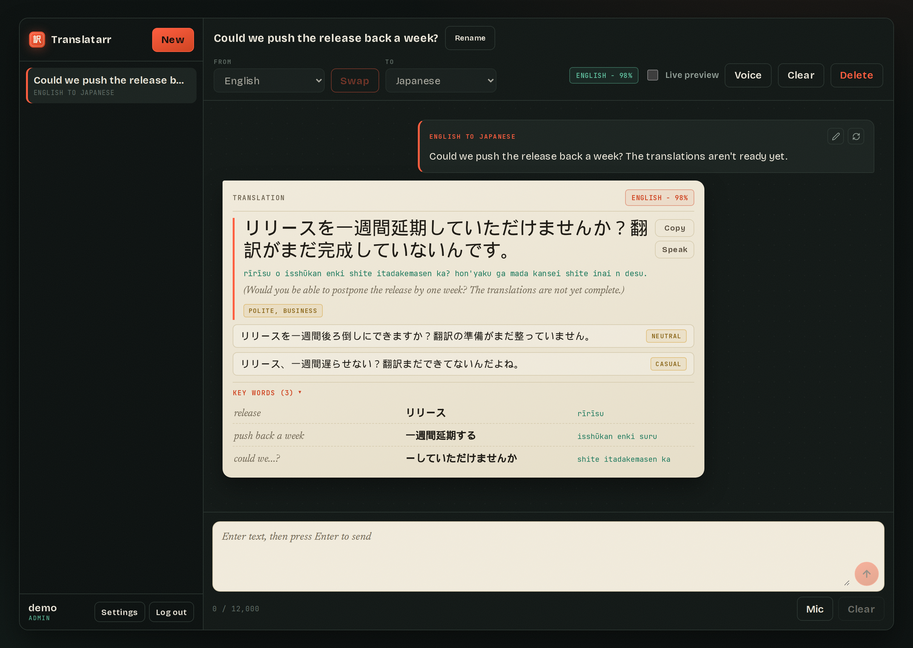
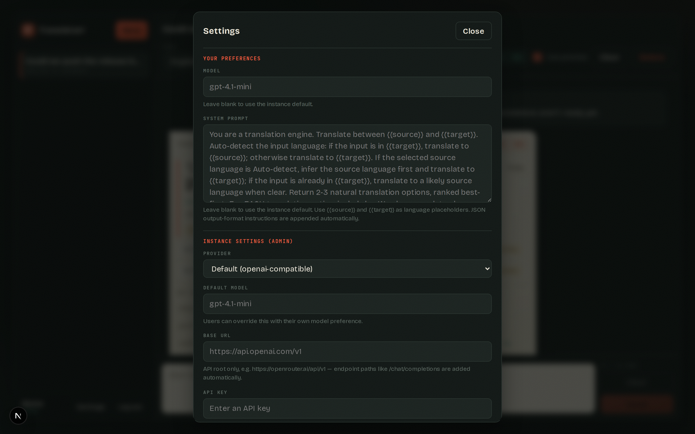

# </img> Translatarr
Structured translations for your homelab. Provider-agnostic LLM translation app with ranked options, glossaries, and back-translation, built on Next.js.


**This is completely vibe-coded. It solves an problem I had. It works fine for me**



## Features

- **Ranked translation options** — every request returns 2–3 natural translations, best first, each tagged with its register (polite/neutral/casual)
- **Back-translation** — each option includes a translation back into the source language so you can verify the meaning before you send it to someone
- **Key-word glossary** — a per-option breakdown mapping each meaningful word or phrase of your input to its counterpart in the translation
- **Romanization** — pinyin, romaji, etc. for non-Latin scripts, on both the translations and the glossary
- **Chats** — translation sessions are persisted to SQLite; live preview translates as you type, sending saves the turn
- **Provider-agnostic** — works with any OpenAI-compatible API (OpenAI, OpenRouter, local llama.cpp/Ollama gateways, …) or the Anthropic API
- **Multi-user** — admin and user roles; the admin configures the instance provider/credentials, each user can override the model and system prompt for themselves
- **PWA** — add it to your phone's home screen and it runs as a standalone app
- **14 languages** — Arabic, Cantonese, Chinese (Mandarin), English, French, German, Greek, Italian, Japanese, Korean, Russian, Spanish, Ukrainian, Vietnamese — plus auto-detect

## Installation

### Docker (recommended)

```bash
docker run -d \
  --name translatarr \
  -p 3000:3000 \
  -v translatarr-data:/app/data \
  ghcr.io/joshrmcdaniel/translatarr:latest
```

Or with compose:

```yaml
services:
  translatarr:
    image: ghcr.io/joshrmcdaniel/translatarr:latest
    ports:
      - "3000:3000"
    volumes:
      - translatarr-data:/app/data
    restart: unless-stopped

volumes:
  translatarr-data:
```

The SQLite database (users, chats, settings) lives in `/app/data` — keep it on a volume.

### Build from source

Requires [bun](https://bun.sh) (and a C++ toolchain for `better-sqlite3` if no prebuilt binary matches your platform).

```bash
git clone https://github.com/joshrmcdaniel/translatarr.git
cd translatarr
bun install
bun run build
bun run start        # serves on http://localhost:3000
```

Or build the image yourself: `docker build -t translatarr .`

## First-run setup

1. Open the app. The first visit shows a setup screen — create the **admin** account.
2. Open **Settings** (bottom of the sidebar) and fill in the *Instance settings* section: provider, API key, and optionally a base URL and default model. Nothing translates until an API key is set.
3. Add more accounts under **Settings → Users** if you're sharing the instance. Each user's chats are private, and users can override the model and system prompt for themselves without touching the instance defaults.

## Configuration

Everything can be configured in-app, so environment variables are optional. When set, they act as defaults that admin settings override:

| Variable | Description | Default |
| --- | --- | --- |
| `LLM_API_KEY` | API key for the provider. Required (here or in Settings) before anything translates. | — |
| `LLM_PROVIDER` | `openai-compatible` or `anthropic` | `openai-compatible` |
| `LLM_MODEL` | Model name | `gpt-5.4-mini` (openai-compatible), `claude-haiku-4-5` (anthropic) |
| `LLM_BASE_URL` | API base URL, e.g. `https://openrouter.ai/api/v1` | provider default |
| `SQLITE_PATH` | Database file location | `data/translatarr.sqlite` |

Settings resolve per value as: **user preference** → **instance setting (admin)** → **environment variable** → built-in default.

The system prompt is also editable (per user or instance-wide) and supports `{{source}}`/`{{target}}` placeholders; the JSON output contract is appended server-side so responses always parse.



## Usage

- Pick a source and target language (source can be *Auto-detect*), type, and send.
- Optionally enable **Live preview** (top bar) to translate as you type, after a short pause. Sending reuses the preview when the text hasn't changed, so it doesn't cost a second LLM call.
- Press **Enter** (or Send) to save the turn to the current chat.
- Translation direction is automatic within the pair: type in either language and it translates to the other one.
- Click an alternative option on a translation card to feature it; the key-word glossary follows the selected option.
- **Rename**/**Clear**/**Delete** manage the current chat from the top bar.

### Behind a reverse proxy / PWA install

Translatarr speaks plain HTTP on port 3000 and is meant to sit behind a reverse proxy (nginx, Caddy, Traefik) that terminates TLS. With HTTPS in front, **Add to Home Screen** on Android/iOS installs it as a standalone app with the 訳 icon.

## Development

```bash
bun install
bun run dev          # dev server on http://localhost:3000
bun run typecheck    # primary correctness gate (there is no test suite)
bun run lint
```

CI builds and pushes the Docker image to GHCR (`linux/amd64` + `linux/arm64`) on every push to `main` and on `v*` tags — see `.github/workflows/docker.yml`.
